# Sistema de gestión de usuarios para Previred

## Introducción:
Se entiende como una "herramienta legacy" (de "legacy", que significa "legado" en inglés) como una herramienta que no 
se considera moderna, pero que todavía se pueden utilizar para desarrollar aplicaciones de software.

El sistema de gestión de usuarios para Previred (en adelante, "este sistema"), consiste en una pequeña 
aplicación Spring Boot que utiliza herramientas legacy para implementar un mantenedor de empleados que permite 
al usuario ver una lista de usuarios, agregar usuarios nuevos y eliminar usuarios existentes, donde cada empleado
tiene la siguiente información: Nombre, Apellido, Rut o DNI, Cargo y Salario.

Este documento permite orientar al usuario acerca de cómo utilizar este sistema, ya sea por medio de un explorador
o por medio de un cliente de API REST como Postman.

## Supuestos aplicados a este sistema
Este sistema fue desarrollado bajo los siguientes supuestos: 
- Además de la información listada en la introducción, cada empleado cuenta con un monto cuyo valor inicial es el salario para ese empleado
- El monto puede estar sujeto a una bonificación cuyo valor debe ser menor o igual a la mitad del salario.
- El monto también puede estar sujeto a uno o más descuentos cuyo total entre todos ellos debe ser menor o igual al salario.

## Tecnologías utilizadas:
Este sistema se divide en una parte frontend, que consiste en una interfaz gráfica visible desde cualquier 
explorador y de una parte backend que puede ser invocada desde un cliente API REST o desde el frontend.

### Backend
- **JDK (Java Developent Kit)**, versión 22 (*Nota: se puede sustituir por OpenJDK 22 o similar*)
- **Apache Maven** para gestión y descarga de dependencias y para establecer la versión de JDK a utilizar.
- **Spring Boot Starter Web**, versión 3.2.5, una "metadependencia" para ser incluida en Maven o Gradle y que alberga los siguientes componentes:
    - **Spring Core**, requerido para todas las aplicaciones que utilizan Spring
    - **Spring Boot**, para ejecutar aplicaciones web, API REST, SOAP y/o servicios de mensajes incorporando un servidor web interno que, por defecto, es Apache Tomcat y que se mantiene en línea mientras la aplicación se esté ejecutando.
    - **Jakarta EE** (*antes Java Enterprise Edition*) para la implementación de servlets y filtros de servlets.
    - **Jackson** 2.15.4 para convertir Strings en formato JSON (Javascript Object Notation) a objetos Java y viceversa.
    - **Sfl4j** para despliegue de logs en línea de comandos
- **Spring Boot Starter JDBC**, versión 3.2.5, otra "metadependencia" que también contiene Spring Core y Spring Boot, entre otros, pero también contiene Spring JDBC para manejo de bases de datos por medio del componente JDBC (Java Database Conectivity)
- **Open Api** versión 2.5.0, que permite usar Swagger para desplegar en un explorador la definición de las API REST implementadas
- **H2** versión 2.2.224, librería que permite implementar un motor interno de base de datos relacional H2 que se mantiene en línea mientras la aplicación esté en ejecución y que preserva los datos almacenados incluso cuando la aplicación no se esté ejecutando.

### Frontend:
- **HTML 5**
- **CSS**
- **Javascript**, especificación ECMA 13 (*Fuente: https://ecma-international.org/publications-and-standards/standards/ecma-13/*)
- **JQuery** versión 4.0.0 para manejo complementario de elementos HTML

## Arquitecturas y patrones de diseño utilizados:

- **DAO**: Objetos que transportan datos a ser almacenados/obtenidos en la base de datos
- **DTO**: Objetos que transportan datos desde el backend al frontend. Un objeto DTO puede ser creado a partir de una clase DAO idéntica y viceversa.
- **Singleton**: Spring, por defecto, aplica el patrón Singleton para crear objetos Beans. Una clase definida con este patrón obliga que exista una y solo una instancia de esa clase en toda la ejecución de la aplicación
- **MVC**: Modelo/Vista/Controlador: Arquitectura en 3 capas con una vista compuesta por: 
  - La parte frontend, que consiste en una página web, un script Javascript propio del proyecto, JQuery y CSS, 
  - Un Servlet como controlador para 
    - enviar/recibir peticiones de la vista 
    - enviar/recibir datos desde el modelo 
  - Una tripla para el modelo que consiste en.
    - Una clase DAO (véase más arriba), que constituye el modelo propiamente tal.
    - Una clase repositorio que ejecuta las sentencias SQL necesarias y proporciona los resultados de consultas
    - Una clase de servicio que sirve como puente entre el controlador y el repositorio

## Instrucciones de uso

### Ejecución

Si usted tiene el código fuente de este proyecto (clonándolo usando GIT), asumiendo que tiene instalada 
la versión 22 de JDK y una versión de Maven compatible con el JDK y los respectivos directorios con los ejecutables JDK 
y de Maven fueron agregados a la variable de entorno PATH, para generar el archivo .JAR con las dependencias y el .JAR
sin ellas, ejecute el siguiente comando en el directorio raíz de la aplicación:

```mvn clean install```

En caso de éxito, ambos archivos .JAR serán generados y guardados en el directorio target dentro de la aplicación.

Si usted obtuvo el ejecutable con las dependencias, ya sea directamente o generándolo de la forma indicada arriba,
asumiendo que JDK 22 está instalado y el directorio con sus ejecutables fue incluido en la variable de entorno PATH, 
entonces para ejecutar el JAR, basta con ejecutar lo siguiente:

```java -jar desafio-legacy-1.0.jar```

### Endpoints definidos en backend
Este sistema define 4 endpoints, cada una con la misma URL, pero con un método HTTP distinto, para las distintas
operaciones que se requiere hacer con los empleados.
Las API REST definidas en el backend pueden ser invocadas desde un cliente REST como Postman o bien desde el frontend.
Refiérase a la sección "Frontend" para saber más acerca del uso de la página web de este sistema.

#### <span style="color:brown">GET</span> /api/empleados

- **Descripción**: Este endpoint sirve para buscar todos los empleados actualmente almacenados en la base de datos. En caso de haber al menos uno, todos serán obtenidos en formato JSON
- **Entrada**: Este endpoint no requiere datos de entrada
- **Salida**: La información completa de todos los empleados, que consiste en:
  - ID: Un identificador numérico asignado automáticamente al empleado al ser creado
  - Nombre del empleado
  - Apellido del empleado
  - RUT/DNI del empleado
  - Cargo del empleado
  - Salario del empleado
  - *Monto actual del empleado*
- **Códigos HTTP disponibles de respuesta**
  - <span style="color:green">200</span> (OK): Se encontró al menos un usuario
  - <span style="color:green">204</span> (No Content): No se encontraron usuarios
  - <span style="color:red">500</span> (Internal Server Error): Error interno al buscar usuarios
- **Comando CURL para ejecutar endpoint** (*Nota: en UNIX, el comando curl viene por defecto. En Windows es necesario instalarlo*): ```curl http://localhost:8080/api/empleados```

#### <span style="color:green">POST</span> /api/empleados

- **Descripción**: Este endpoint sirve para crear un nuevo empleado. La creación está sujeta a restricciones que, de no cumplirse, harán que el código HTTP de respuesta obtenido sea 400 ("Bad Request")
- **Entrada**: Un cuerpo en formato JSON con los siguientes campos. Todos los campos son obligatorios:
  - Nombre del empleado
  - Apellido del empleado
  - RUT o DNI del empleado: *número entero positivo entre 1000000 y 99999999, sin puntos, con guion y un dígito verificador que concuerde con el número, según lo establecido en
    https://es.wikipedia.org/wiki/Rol_%C3%9Anico_Tributario)*
  - Cargo del empleado
  - Salario: *número entero positivo mayor o igual que 400000*
- **Salida**: Un mensaje de éxito o de error (véase más abajo) para indicar si se creó exitosamente el empleado o se detectaron errores al intentar crearlo.
- **Códigos HTTP disponibles de respuesta**
    - <span style="color:green">201</span> (Created): Usuario creado exitosamente con un ID asignado automáticamente y un monto inicial igual al salario.
    - <span style="color:magenta">400</span> (Bad Request): Si ocurre una de las siguientes situaciones con los datos de entrada:
      - Se omitió al menos un campo de la entrada.
      - El RUT o DNI ingresado no es válido (tanto en formato como en validación del dígito verificador)
      - El RUT ingresado ya existe en la base de datos
      - El salario ingresado es menor a $400000 CLP
    - <span style="color:red">500</span>: Error interno al intentar crear el empleado.
- **Comando CURL para ejecutar endpoint** ```curl -X POST http://localhost:8080/api/empleados -H Content-Type: application/json -d '{"rut":"< rut >","nombre":"< nombre >","salario":< salario >,"apellido":"< apellido >","cargo":"< cargo >"}'``` 

#### <span style="color:red">DELETE</span> /api/empleados?id=< número >

- **Descripción**: Este endpoint sirve para eliminar un empleado existente por medio de su id
- **Entrada**: Un número positivo representando el ID de un empleado. A diferencia de los demás API que requieren datos de entrada como cuerpos en formato JSON, este requiere un número en el query string de la URL (véase arriba) bajo la clave id
- **Salida**: Un mensaje de éxito o de error (véase más abajo) para indicar si se eliminó exitosamente el empleado o se detectaron errores al intentar eliminarlo.
- **Códigos HTTP disponibles de respuesta**
    - <span style="color:green">200</span>: Usuario eliminado exitosamente. (*Nota: El ID del usuario eliminado no se puede reutilizar*)
    - <span style="color:magenta">400</span>: Si no se ingresó un ID o el ID ingresado no es ún número entero o hace referencia a un usuario inexistente (*Nota: No existen usuarios con ID negativo o cero*)
    - <span style="color:red">500</span>: Error interno al intentar eliminar el empleado.
- **Comando CURL para ejecutar endpoint** (*Nota: en UNIX, el comando curl viene por defecto. En Windows es necesario instalarlo*): ```curl -X DELETE http://localhost:8080/api/empleados?id=< id >```

#### <span style="color:purple">PATCH</span> /api/empleados

- **Descripción**: Este endpoint sirve para crear actualizar el monto actual de un empleado, agregando o disminuyendo a ese valor un monto ingresado.
- **Entrada**: Un cuerpo en formato JSON con los siguientes campos. Todos los campos son obligatorios:
    - ID del empleado (se puede visualizar al buscar la lista de usuarios)
    - Monto a agregar o disminuir al monto actual
    - Tipo: Uno y solo uno de los siguientes valores:
      - 1: El monto ingresado se agregará como bonificación al monto actual del empleado.
      - -1: El monto ingresado se le restará al monto actual del empleado como descuento.
- **Salida**: Un mensaje de éxito o de error indicando si se actualizó el monto del empleado o si hubo un error al intentar actualizarlo.
- **Códigos HTTP disponibles de respuesta**
    - <span style="color:green">200</span>: Monto del empleado actualizado exitosamente
    - <span style="color:magenta">400</span>: Si ocurre una de las siguientes situaciones:
      - El monto ingresado es negativo o cero
      - El monto ingresado no es un número entero
      - El tipo es distinto de 1 y -1.
      - El tipo es 1 y el monto ingresado es mayor a la mitad del salario.
      - El tipo es -1 y el monto ingresado es mayor al salario.
      - El ID hace referencia a un usuario inexistente
    - <span style="color:red">500</span>: Error interno al intentar actualizar el monto del empleado.
- **Comando CURL para ejecutar endpoint** ```curl -X PATCH http://localhost:8080/api/empleados -H Content-Type: application/json -d '{"id":< id >,"monto":"< monto >","tipo":"< 0 | 1 >"}'``` 

También es posible visualizar los endpoints desde un explorador al ingresar al sitio http://localhost:8080/swagger-ui/index.html

### Frontend

#### Inicio
Se puede acceder a la página de inicio de este sistema ingresando al sitio http://localhost:8080/

Al llegar allí, usted se encontrará con esta interfaz (*Nota: Se puede mejorar en el futuro*), tomando
en cuenta de que la lista de empleados está inicialmente *vacía*

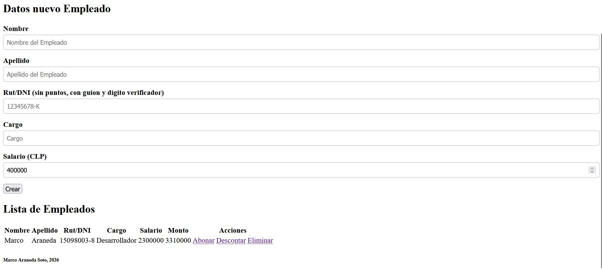

#### Agregar nuevo empleado

Para crear un nuevo empleado, llene los datos de los campos de texto que están sobre la lista de empleados
y luego pulse el botón "Crear"

En caso de éxito, se mostrará la lista actualizada y un mensaje en verde indicando que el empleado fue creado exitosamente

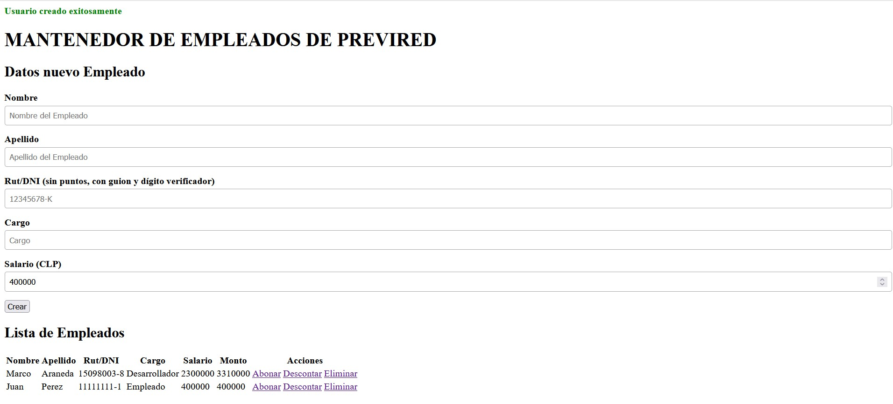

Por cada empleado existente en la base de datos, se mostrará la siguiente información:
- Nombre
- Apellido
- RUT/DNI
- Cargo
- Salario
- Acciones para el empleado:
  - Agregar un bono usando el ID del empleado para asociación y su salario para validación
  - Agregar uno o más descuentos usando
  - Eliminar el empleado
  
En caso de error, se mostrará el mensaje apropiado en rojo sobre el formulario. Las siguientes imágenes mostrarán, respectivamente los mensajes de error para las siguientes situaciones:
- Campo(s) faltante(s) al tratar de crear el empleado
  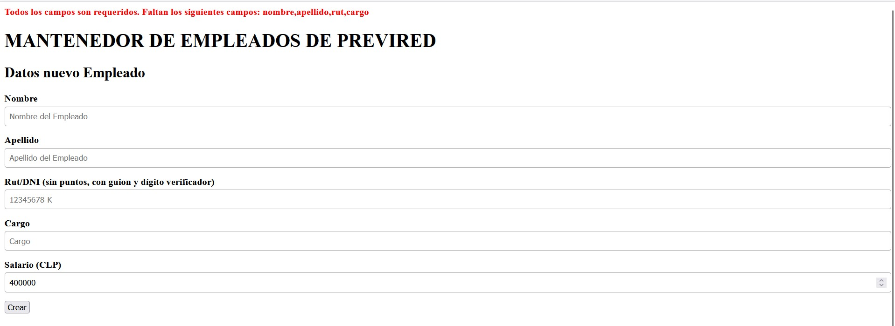
- Rut inválido
  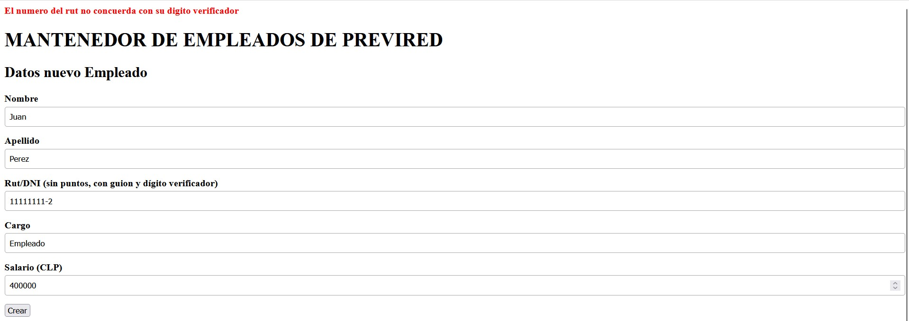
- Rut ya existente en la base de datos
  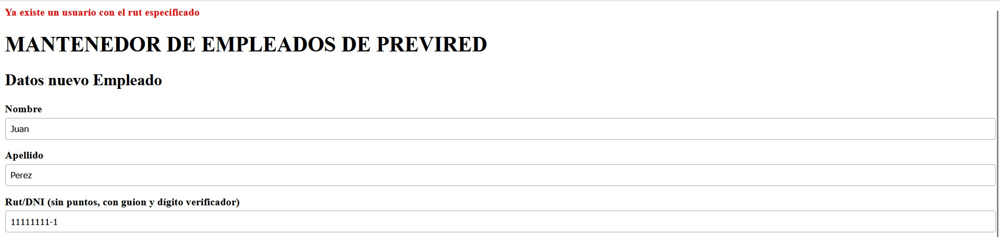
- Salario menor que 400000
  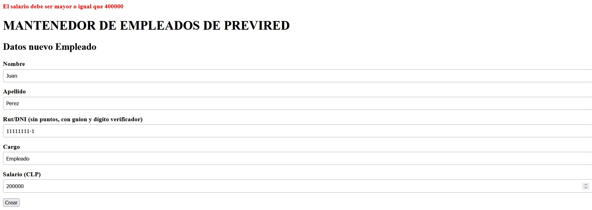

#### Descontar bono

Al pulsar el enlace para agregar un nuevo descuento, el formulario actual será reemplazado por el siguiente
formulario:

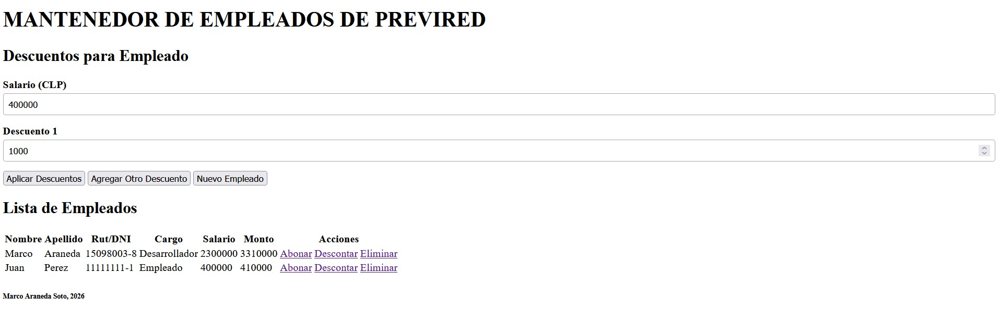

Aquí se mostrará el salario, que no se puede modificar en este formulario, ya que el campo de texto es de
solo lectura. También se mostrará el campo numérico para el primer o único descuento.
Si se desea agregar más descuentos, basta con pulsar el botón Agregar Otro Descuento.

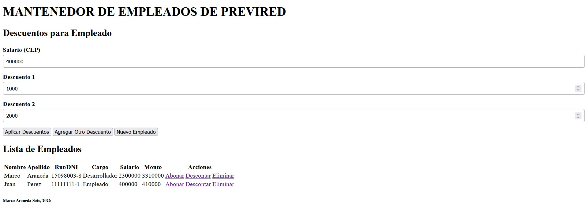

Cuando el usuario esté listo para aplicar todos los descuentos al empleado, podrá hacerlo pulsando el 
botón Aplicar Descuentos. En caso de éxito, se mostrará un mensaje indicando que la operación fue 
exitosa, se refrescará automáticamente la lista de empleados mostrando el nuevo monto resultante de 
restar al monto antiguo la suma de todos los montos ingresados. Finalmente, todos los campos numéricos de 
descuentos serán descartados excepto el primero.

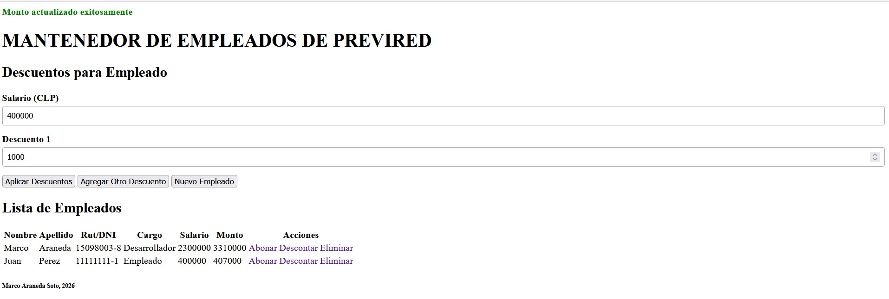

Todos los descuentos son obligatorios. Si al menos uno de los campos de los descuentos está en blanco,
se mostrará un mensaje de error y no se aplicará ningún descuento.

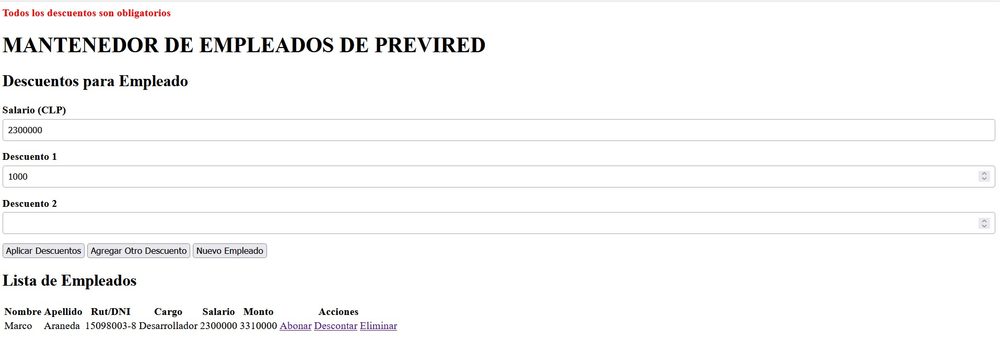

Si todos los descuentos fueron ingresados, pero la suma de todos ellos es mayor que el salario, se mostrará
otro mensaje de error y no se aplicarán los descuentos.

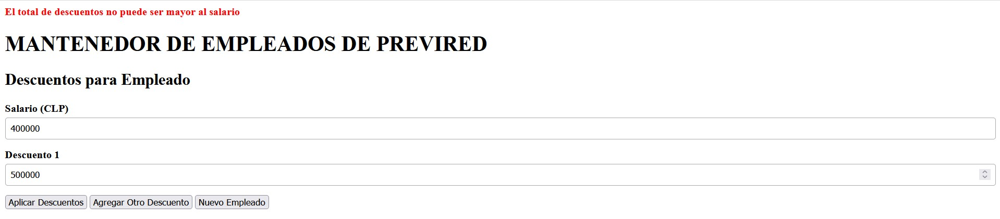

Si se desea abortar el proceso de descontar dinero al empleado, basta con pulsar el enlace para aplicar
un bono al mismo u otro empleado, pulsar el enlace para aplicar un descuento para otro empleado o pulsar 
el botón Nuevo Empleado para volver al formulario para crear un nuevo empleado.

#### Agregar bono

Al pulsar el enlace para agregar un nuevo bono, el formulario para crear un nuevo empleado será reemplazado
por el siguiente formulario

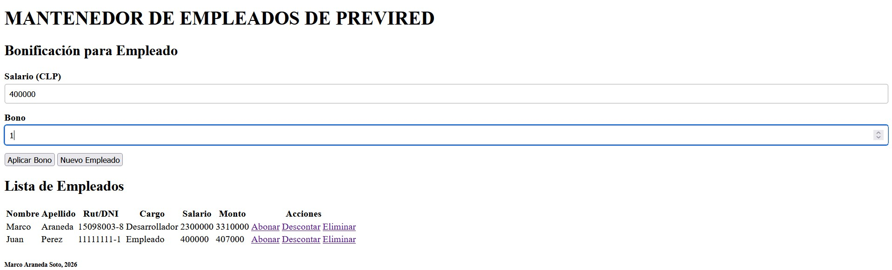

Aquí se mostrará el salario, que no se puede modificar en este formulario, ya que el campo de texto es de solo lectura
y la cantidad a abonar. Si se pulsa el botón "Aplicar Bono" teniendo ingresado un valor correcto para el 
bono, se mostrará un mensaje de éxito y se refrescará automáticamente la lista de empleados con el nuevo 
monto resultante de sumar el monto ingresado al monto antiguo.

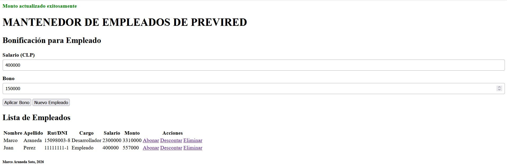

El bono a agregar es obligatorio. Si se pulsa el botón "Aplicar Bono" sin un bono ingresado, se mostrará 
un mensaje de error y el bono no se aplicará.

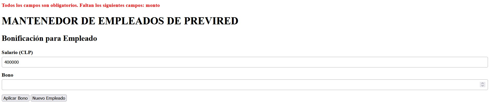

Si se ingresó un bono y ese bono es mayor que la mitad del salario, se mostrará otro mensaje de error y
el bono no se aplicará.

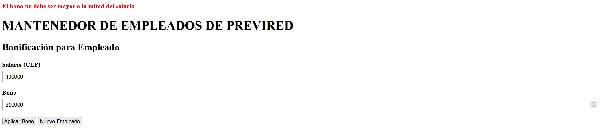

Si se desea abortar el proceso de abonar dinero al empleado, basta con pulsar el enlace para aplicar
un descuento al mismo u otro empleado, pulsar el enlace para aplicar un bono para otro empleado o pulsar
el botón Nuevo Empleado para volver al formulario para crear un nuevo empleado.

#### Eliminar empleado

Cuando el empleado pulsa el enlace para eliminar, en caso de éxito, se mostrará un mensaje y el empleado
será removido de la lista.

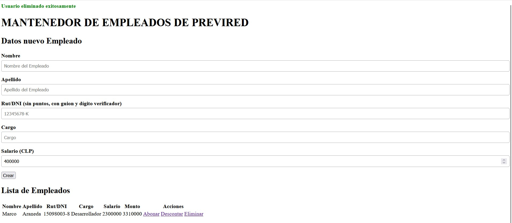

Los únicos errores que pueden ocurrir al tratar de eliminar un empleado son errores internos.