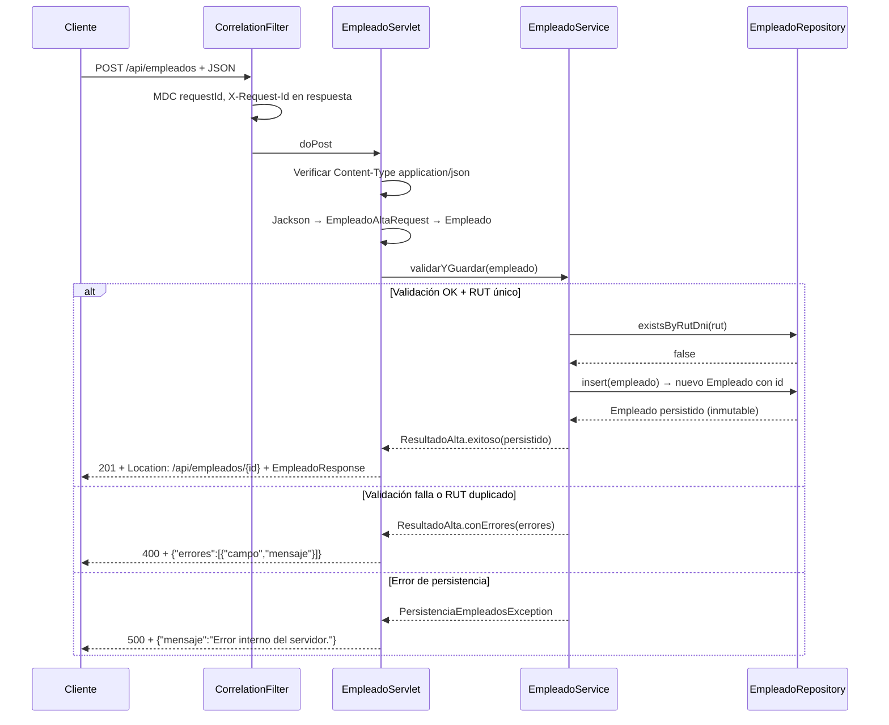

# empleados-api

API REST de gestión de empleados implementada con **`HttpServlet` puro** y **JDBC explícito** sobre Spring Boot 2.7 como contenedor. Sin `@RestController`, sin JPA, sin ORM. Interfaz web con HTML + **Fetch API** (AJAX), sin frameworks de frontend.

---

## Tabla de contenidos

1. [Stack tecnológico](#stack-tecnológico)
2. [Requisitos previos](#requisitos-previos)
3. [Inicio rápido](#inicio-rápido)
4. [Estructura del proyecto](#estructura-del-proyecto)
5. [Arquitectura y decisiones de diseño](#arquitectura-y-decisiones-de-diseño)
6. [Contrato de la API](#contrato-de-la-api)
7. [Reglas de negocio](#reglas-de-negocio)
8. [Validación de RUT chileno](#validación-de-rut-chileno)
9. [Seguridad](#seguridad)
10. [Observabilidad y trazabilidad](#observabilidad-y-trazabilidad)
11. [Tests automatizados y cobertura](#tests-automatizados-y-cobertura)
12. [Trazabilidad al enunciado del desafío](#trazabilidad-al-enunciado-del-desafío)
13. [Producción y perfiles](#producción-y-perfiles)
14. [Consola H2 (desarrollo)](#consola-h2-desarrollo)
15. [Decisiones de arquitectura (ADRs)](#decisiones-de-arquitectura-adrs)
16. [Riesgos conocidos y fuera de alcance](#riesgos-conocidos-y-fuera-de-alcance)

---

## Stack tecnológico

| Capa | Tecnología |
|---|---|
| Lenguaje | Java 8 (source/target) |
| Runtime / contenedor | Spring Boot 2.7.18, Tomcat embebido |
| HTTP handler | `javax.servlet.HttpServlet` — sin `@RestController` |
| Persistencia | JDBC (`PreparedStatement`, `DataSource`) — sin JPA |
| Base de datos | H2 en memoria (`empleadosdb`) |
| JSON | Jackson `ObjectMapper` (reutilizado de Spring Boot) |
| Build | Maven 3 (Maven Wrapper incluido) |
| Tests | JUnit 5, Mockito, Spring Boot Test, AssertJ |
| Cobertura | JaCoCo 0.8.11 (mínimo 80 % de instrucciones en build) |
| Arquitectura | ArchUnit 1.3.0 (reglas de dependencias entre capas verificadas en CI) |
| Frontend | HTML5 semántico + Vanilla JS con Fetch API — sin React/Angular/Vue |

---

## Requisitos previos

- **JDK 8** o superior instalado y `JAVA_HOME` apuntando a él.
- Maven **no es necesario**: el repositorio incluye Maven Wrapper (`mvnw` / `mvnw.cmd`).
- Si se prefiere Maven instalado: versión 3.6 o superior.

---

## Inicio rápido

### Levantar la aplicación

**Windows (PowerShell o CMD):**

```powershell
cd empleados-api
.\mvnw.cmd spring-boot:run
```

**Linux / macOS / Git Bash:**

```bash
cd empleados-api
./mvnw spring-boot:run
```

La primera ejecución descarga Apache Maven automáticamente (una sola vez).

Abrir en el navegador: **http://localhost:8080/**

### Probar la API desde el navegador

La aplicación incluye una interfaz web completa. No se necesita Postman ni terminal.

#### Paso 1 — Levantar la aplicación

```powershell
.\mvnw.cmd spring-boot:run
```

Esperar hasta ver en la consola:
```
Tomcat started on port(s): 8080
Started EmpleadosApplication
```

#### Paso 2 — Abrir la interfaz

Ir a **http://localhost:8080/** en el navegador. Se carga la página con el formulario y la tabla de empleados (inicialmente vacía).

#### Paso 3 — Crear un empleado

1. Completar el formulario con los datos del empleado:
   - **Nombre** y **Apellido** — obligatorios
   - **RUT** — formato chileno válido, por ejemplo `12.345.678-5`
   - **Cargo** — obligatorio
   - **Salario base** — mínimo `400000`
   - **Bono** — opcional, máximo 50% del salario base
   - **Descuentos** — opcional, no puede superar el salario base
2. Hacer clic en **Agregar empleado**.
3. Si los datos son válidos: el empleado aparece en la tabla sin recargar la página.
4. Si hay errores: se muestran los mensajes debajo del formulario, sin `alert()`.

#### Paso 4 — Listar empleados

La tabla se actualiza automáticamente después de cada alta. Para refrescarla manualmente hacer clic en **Actualizar lista**.

#### Paso 5 — Eliminar un empleado

Hacer clic en el botón **Eliminar** de la fila correspondiente. La fila desaparece de la tabla sin recargar la página.

#### Paso 6 — Probar validaciones

Intentar crear un empleado con datos inválidos para ver los errores en pantalla:

| Caso | Dato a ingresar |
|---|---|
| RUT inválido | `12.345.678-0` (dígito verificador incorrecto) |
| Salario bajo el mínimo | `300000` |
| Bono excesivo | Bono mayor al 50% del salario ingresado |
| RUT duplicado | Mismo RUT de un empleado ya creado |

En todos los casos el error aparece en la página — nunca como `alert()`.

### Ejecutar los tests

```powershell
.\mvnw.cmd clean test
```

Ver el informe de cobertura JaCoCo tras los tests:

```
target/site/jacoco/index.html
```

### Levantar y probar con Docker (PowerShell)

> Requiere Docker Desktop instalado y corriendo. Verificar con `docker ps` — si no hay error, Docker está listo.

#### Paso 1 — Levantar la aplicación

Desde la carpeta `empleados-api`, en una terminal PowerShell:

```powershell
docker run --rm -p 8080:8080 -v "${PWD}:/app" -w /app maven:3.9.6-eclipse-temurin-8 mvn spring-boot:run
```

La primera vez descarga la imagen Maven (~500 MB). Las siguientes veces usa la caché local.

Esperar hasta ver en los logs:

```
Tomcat started on port(s): 8080
Started EmpleadosApplication
```

#### Paso 2 — Abrir una segunda terminal PowerShell

Dejar la primera terminal con los logs visibles y abrir una nueva (**Ctrl+Shift+`** en VS Code).

#### Paso 3 — Verificar que la app responde

```powershell
Invoke-RestMethod -Uri "http://localhost:8080/api/empleados" -Method Get
```

Respuesta esperada: `[]` (lista vacía — la BD H2 arranca limpia).

#### Paso 4 — Crear un empleado

```powershell
$body = '{"nombre":"Ana","apellido":"Perez","rutDni":"12.345.678-5","cargo":"Dev","salarioBase":500000,"bono":100000,"descuentos":50000}'
Invoke-RestMethod -Uri "http://localhost:8080/api/empleados" -Method Post -ContentType "application/json" -Body $body
```

Respuesta esperada: `201 Created` con el empleado creado y su `id` asignado.

#### Paso 5 — Listar empleados

```powershell
Invoke-RestMethod -Uri "http://localhost:8080/api/empleados" -Method Get
```

Respuesta esperada: array con el empleado creado en el paso anterior.

#### Paso 6 — Eliminar un empleado

Reemplazar `1` por el `id` que retornó el paso 4:

```powershell
Invoke-RestMethod -Uri "http://localhost:8080/api/empleados/1" -Method Delete
```

Respuesta esperada: `204 No Content`.

#### Paso 7 — Verificar que fue eliminado

```powershell
Invoke-RestMethod -Uri "http://localhost:8080/api/empleados" -Method Get
```

Respuesta esperada: `[]`.

---

> **Nota:** al detener el contenedor Docker (`Ctrl+C` en la terminal de la app), la base de datos H2 en memoria se borra. Los datos no persisten entre reinicios — comportamiento esperado para este entorno de desarrollo.

---

## Estructura del proyecto

```
empleados-api/
├── docs/adr/                              Decisiones de arquitectura (ADR)
│   ├── 001-servlet-y-jdbc-sin-restcontroller.md
│   ├── 002-formato-errores-sin-rfc7807.md
│   └── 003-jackson-en-servlet.md
├── src/
│   ├── main/
│   │   ├── java/com/desafio/empleados/
│   │   │   ├── EmpleadosApplication.java  Punto de entrada Spring Boot
│   │   │   ├── api/ApiFields.java         Constantes de campos JSON
│   │   │   ├── config/                    Registro de servlet y filtros
│   │   │   ├── dto/                       Contratos HTTP de entrada/salida
│   │   │   ├── exception/                 PersistenciaEmpleadosException
│   │   │   ├── model/                     Entidad de dominio + modelos de error
│   │   │   ├── repository/                JDBC puro (sin JPA)
│   │   │   ├── service/                   Reglas de negocio + transacciones
│   │   │   ├── servlet/                   HttpServlet (capa HTTP)
│   │   │   ├── validation/                Validador RUT chileno
│   │   │   └── web/                       Filtros HTTP (correlación, seguridad)
│   │   └── resources/
│   │       ├── application.properties     Config desarrollo (H2, puerto, logging)
│   │       ├── application-prod.properties Config producción
│   │       ├── schema.sql                 DDL de la tabla empleado
│   │       ├── openapi/openapi.yaml       Especificación OpenAPI 3.0.3
│   │       └── static/                    Frontend (HTML, JS, CSS)
│   └── test/
│       └── java/com/desafio/empleados/
│           ├── architecture/              ArchUnit: reglas de capas
│           ├── dto/                       Tests del mapper
│           ├── integration/               Tests de integración HTTP completos
│           ├── model/                     equals/hashCode
│           ├── repository/                Tests de integración JDBC + H2
│           ├── service/                   Tests de reglas de negocio con Mockito
│           ├── servlet/                   Tests unitarios HTTP mock
│           └── validation/                Tests del validador RUT
└── pom.xml
```

---

## Arquitectura y decisiones de diseño

### Capas y dependencias

```
                        ┌──────────────────────────────────┐
                        │          EmpleadoServlet          │  HTTP (javax.servlet)
                        │  doGet / doPost / doDelete        │
                        └────────────────┬─────────────────┘
                                         │ usa
                        ┌────────────────▼─────────────────┐
                        │          EmpleadoService          │  Reglas de negocio
                        │  validarYGuardar / listar /       │  @Transactional
                        │  eliminar → ResultadoAlta         │
                        └────────────────┬─────────────────┘
                                         │ usa
                        ┌────────────────▼─────────────────┐
                        │       EmpleadoRepository          │  JDBC puro
                        │  findAll / findById / insert /    │  PreparedStatement
                        │  existsByRutDni / deleteById      │
                        └──────────────────────────────────┘
```

**Regla de dependencias** (verificada por ArchUnit en cada build):
- `service` y `repository` **no pueden importar** clases de `servlet` ni de `dto`.
- No existen dependencias circulares entre paquetes raíz.

### Decisiones clave

| Decisión | Razonamiento |
|---|---|
| `HttpServlet` en lugar de `@RestController` | Requisito explícito del desafío. Spring Boot actúa solo como contenedor. Ver [ADR-001](docs/adr/001-servlet-y-jdbc-sin-restcontroller.md). |
| JDBC explícito en lugar de JPA/Hibernate | Requisito explícito. Toda interacción con BD es mediante `PreparedStatement`. |
| `ResultadoAlta` como retorno de `validarYGuardar` | Errores de validación como valores, no como excepciones. Evita el anti-patrón de excepciones para control de flujo esperado. |
| `insert()` inmutable | El repositorio retorna un **nuevo** `Empleado` con el id asignado en lugar de mutar el argumento. Elimina side-effects ocultos. |
| Formato de error propio vs RFC 7807 | Simplicidad para el alcance del desafío. Ver [ADR-002](docs/adr/002-formato-errores-sin-rfc7807.md). |
| Jackson del contexto Spring | Reutiliza el `ObjectMapper` configurado por Spring Boot en lugar de añadir un parser manual. Ver [ADR-003](docs/adr/003-jackson-en-servlet.md). |
| Manejo de race condition en duplicados | Primero `existsByRutDni()`, luego captura de `SQLState 23505` tras el `INSERT` como fallback para la ventana TOCTOU. Ambos caminos retornan el mismo error de negocio. |

---

## Diagrama de secuencia — POST /api/empleados



---

## Contrato de la API

La especificación completa está en **`src/main/resources/openapi/openapi.yaml`** (OpenAPI 3.0.3).

Para explorarla visualmente, importar el archivo en **Postman** o **Insomnia**:

- **Postman:** `Import` → `File` → seleccionar `openapi.yaml`
- **Insomnia:** `Import` → `From File` → seleccionar `openapi.yaml`

### Endpoints

| Método | Ruta | Descripción |
|---|---|---|
| `GET` | `/api/empleados` | Lista todos los empleados como array JSON. |
| `POST` | `/api/empleados` | Da de alta un empleado. Requiere `Content-Type: application/json`. |
| `DELETE` | `/api/empleados/{id}` | Elimina el empleado con el `id` indicado. |

### Códigos de respuesta

| Código | Situación |
|---|---|
| `200 OK` | `GET` exitoso. |
| `201 Created` | `POST` exitoso. Incluye cabecera `Location: /api/empleados/{id}` y el empleado creado en el cuerpo. |
| `204 No Content` | `DELETE` exitoso. |
| `400 Bad Request` | Validación fallida, reglas de negocio no cumplidas, JSON ilegible o id no numérico en `DELETE`. Cuerpo: `{"errores":[{"campo":"...","mensaje":"..."}]}` |
| `404 Not Found` | Empleado no encontrado en `DELETE`, o ruta no soportada. |
| `405 Method Not Allowed` | `PUT` o `PATCH` sobre `/api/empleados`. Incluye cabecera `Allow`. |
| `415 Unsupported Media Type` | `POST` sin `Content-Type: application/json`. |
| `500 Internal Server Error` | Error técnico de persistencia. Detalle en logs con `requestId`. Cuerpo: `{"mensaje":"Error interno del servidor."}` |

### Esquema del cuerpo POST

```json
{
  "nombre":      "string (requerido)",
  "apellido":    "string (requerido)",
  "rutDni":      "string (requerido, RUT chileno válido)",
  "cargo":       "string (requerido)",
  "salarioBase": "number (requerido, mínimo 400000)",
  "bono":        "number (opcional, default 0)",
  "descuentos":  "number (opcional, default 0)"
}
```

### Probar con Postman

#### Listar empleados

| Campo | Valor |
|---|---|
| Método | `GET` |
| URL | `http://localhost:8080/api/empleados` |

No requiere headers ni body.

---

#### Dar de alta un empleado

| Campo | Valor |
|---|---|
| Método | `POST` |
| URL | `http://localhost:8080/api/empleados` |
| Header | `Content-Type: application/json` |
| Body | `raw` → `JSON` |

```json
{
  "nombre": "Ana",
  "apellido": "Perez",
  "rutDni": "12.345.678-5",
  "cargo": "Dev",
  "salarioBase": 500000,
  "bono": 100000,
  "descuentos": 50000
}
```

Respuesta exitosa: `201 Created` con cabecera `Location: /api/empleados/{id}` y el empleado creado en el cuerpo.

---

#### Eliminar un empleado

| Campo | Valor |
|---|---|
| Método | `DELETE` |
| URL | `http://localhost:8080/api/empleados/{id}` (reemplazar `{id}` por el id numérico) |

No requiere headers ni body. Respuesta exitosa: `204 No Content`.

---

### Probar desde PowerShell

> `curl` en PowerShell es un alias de `Invoke-WebRequest` y no acepta los flags de curl real. Usar siempre `Invoke-RestMethod` para llamadas HTTP desde PowerShell.

**Listar empleados:**

```powershell
Invoke-RestMethod -Uri "http://localhost:8080/api/empleados" -Method Get
```

**Dar de alta un empleado:**

```powershell
$body = '{"nombre":"Ana","apellido":"Perez","rutDni":"12.345.678-5","cargo":"Dev","salarioBase":500000,"bono":100000,"descuentos":50000}'
Invoke-RestMethod -Uri "http://localhost:8080/api/empleados" -Method Post -ContentType "application/json" -Body $body
```

**Eliminar un empleado (reemplazar `1` por el id real):**

```powershell
Invoke-RestMethod -Uri "http://localhost:8080/api/empleados/1" -Method Delete
```

---

## Reglas de negocio

Validadas en `EmpleadoService.validarReglas()` (backend autoritativo) y replicadas en `empleados.js` (UX preventiva):

| Campo | Regla |
|---|---|
| `nombre` | Obligatorio, no puede estar en blanco. |
| `apellido` | Obligatorio, no puede estar en blanco. |
| `rutDni` | Obligatorio. Debe ser un RUT chileno válido (formato y dígito verificador módulo 11). |
| `cargo` | Obligatorio, no puede estar en blanco. |
| `salarioBase` | Obligatorio. No negativo. Mínimo **$400.000**. |
| `bono` | No negativo. No puede superar el **50 % del salario base**. |
| `descuentos` | No negativo. No puede superar el **salario base**. |
| `rutDni` (unicidad) | No pueden existir dos empleados con el mismo RUT (constraint `UNIQUE` en BD + verificación previa en servicio). |

Las respuestas `400` incluyen **todos** los errores detectados en una sola llamada, nunca uno solo:

```json
{
  "errores": [
    { "campo": "salarioBase", "mensaje": "El salario base no puede ser menor a $400.000." },
    { "campo": "bono",        "mensaje": "Los bonos no pueden superar el 50% del salario base." }
  ]
}
```

---

## Validación de RUT chileno

`RutChilenoValidator` implementa el algoritmo módulo 11 completo:

1. **Normalización**: elimina puntos y guiones, pone en mayúscula el dígito verificador `K`, reensambla como `NNNNNNN-D`.
2. **Formato plausible**: regex `[0-9]{7,8}-[0-9K]`.
3. **Dígito verificador**: algoritmo módulo 11 estándar chileno.

El mismo algoritmo está implementado en JavaScript en `empleados.js`, garantizando validación simétrica cliente-servidor. El backend sigue siendo la fuente autoritativa.

Formatos aceptados en la entrada: `12345678-5`, `12.345.678-5`, `123456785` (sin guión).

---

## Seguridad

`SecurityHeadersFilter` inyecta las siguientes cabeceras HTTP en **todas** las respuestas (excepto `/h2-console` que usa `startsWith` para la exclusión):

| Cabecera | Valor | Propósito |
|---|---|---|
| `X-Content-Type-Options` | `nosniff` | Evita MIME-sniffing en el navegador. |
| `X-Frame-Options` | `DENY` | Previene clickjacking. |
| `Referrer-Policy` | `strict-origin-when-cross-origin` | Limita la información de referrer. |
| `Permissions-Policy` | `geolocation=(), microphone=(), camera=()` | Deshabilita APIs sensibles del navegador. |
| `Content-Security-Policy` | `default-src 'self'; script-src 'self'; style-src 'self' 'unsafe-inline'; img-src 'self' data:; frame-ancestors 'none'` | Restringe las fuentes de contenido cargable; refuerza anti-clickjacking a nivel de CSP. |

**Frontend:**
- Escape HTML mediante `element.textContent → innerHTML` (patrón correcto anti-XSS, sin concatenación de strings).
- Sin `eval()`, sin `innerHTML` con datos no escapados.
- Sin uso de `alert()` en ningún flujo de error.

---

## Observabilidad y trazabilidad

`RequestCorrelationFilter` (aplicado a `/api/*`):

- Lee la cabecera `X-Request-Id` entrante; si no está presente, genera un UUID.
- Lo escribe en **SLF4J MDC** como `requestId` — aparece en **cada línea de log** de esa petición.
- Lo devuelve en la cabecera `X-Request-Id` de la respuesta.
- Limpia el MDC en bloque `finally` (sin fugas entre threads del pool de Tomcat).

Ejemplo de línea de log:
```
2026-04-14 23:00:01.123  INFO [nio-8080-exec-1] [a3f2c1d8-...] c.d.e.servlet.EmpleadoServlet : POST /api/empleados
```

El `requestId` permite correlacionar todas las trazas de una petición en sistemas de logging centralizados (ELK, CloudWatch, etc.).

---

## Tests automatizados y cobertura

### Suite completa

```powershell
.\mvnw.cmd clean test
```

### Clases de test

| Clase | Tipo | Cobertura |
|---|---|---|
| `RutChilenoValidatorTest` | Unidad pura | Normalización, RUTs válidos/inválidos via `@ParameterizedTest` (18 casos). |
| `EmpleadoServiceTest` | Unidad (Mockito) | Todas las reglas de negocio, duplicado RUT, `SQLState 23505`, `PersistenciaEmpleadosException`, inmutabilidad del argumento en `insert`. |
| `EmpleadoServletUnitTest` | Unidad (MockMvc) | Todos los códigos HTTP: 200, 201, 204, 400, 404, 405, 415, 500. |
| `EmpleadoMapperTest` | Unidad | Mapeo bidireccional DTO ↔ entidad, todos los campos. |
| `ModelEqualsTest` | Unidad | `equals()`/`hashCode()` en `Empleado` (por id) y `ErrorRegistro`. |
| `EmpleadoRepositoryIntegrationTest` | Integración (H2) | `findById` vacío, `insert` → `findById`, verificación de inmutabilidad del argumento, cleanup con `@AfterEach`. |
| `EmpleadoServletIntegrationTest` | Integración (Spring Boot + H2) | Flujo completo HTTP: `GET`, `POST→GET→DELETE`, JSON inválido, 405, 400 por validación, propagación de `X-Request-Id`. |
| `PackageDependencyRulesTest` | Arquitectura (ArchUnit) | 7 reglas: `service`/`repository` no dependen de `servlet`/`dto`/`api`; sin ciclos entre paquetes raíz. |

### Cobertura JaCoCo

El build **falla** si la cobertura de instrucciones cae por debajo del **80 %**. Tras `mvn test`, abrir en el navegador:

```
target/site/jacoco/index.html
```

---

## Trazabilidad al enunciado del desafío

| Requisito | Implementación |
|---|---|
| Java 8+, Maven, Spring Boot, Tomcat embebido | `pom.xml` (Java 8), `EmpleadosApplication`, Tomcat via `spring-boot-starter-web`. |
| `GET /api/empleados` — lista JSON | `EmpleadoServlet.doGet()` → `EmpleadoService.listar()` → `EmpleadoRepository.findAll()`. |
| `POST /api/empleados` — alta JSON con validación | `EmpleadoServlet.doPost()` → `EmpleadoService.validarYGuardar()` → `EmpleadoRepository.insert()`. |
| `DELETE /api/empleados/{id}` — baja | `EmpleadoServlet.doDelete()` → `EmpleadoService.eliminar()` → `EmpleadoRepository.deleteById()`. |
| Persistencia **JDBC** + **H2 en memoria** | `EmpleadoRepository` (solo `PreparedStatement`), `schema.sql`, `application.properties`. |
| Solo Servlets y JDBC (sin capa REST/ORM extra) | `HttpServlet` sin `@RestController`; JDBC sin JPA en el flujo principal. |
| Interfaz HTML + JavaScript + Fetch, sin frameworks | `src/main/resources/static/` — HTML semántico, IIFE JS, Fetch API. |
| **Sin `alert()`** en el frontend | Errores en `role="alert"` + `aria-live` en el DOM; sin ningún `alert()`. |
| Manejo de excepciones y logging | `PersistenciaEmpleadosException` → HTTP 500 + log con `requestId` en MDC. |
| **Parte 2:** reglas de negocio (RUT único, salario mínimo, bono/descuentos) | `EmpleadoService.validarReglas()` + manejo de race condition TOCTOU en duplicados. |
| **Parte 2:** validaciones en frontend antes de enviar | `validarFormulario()` en `empleados.js` — mismas reglas que el backend. |
| Respuestas `400` con JSON de errores | `{"errores":[{"campo","mensaje"}]}` en todos los caminos de validación. |

---

## Producción y perfiles

Activar el perfil de producción:

```bash
java -jar target/empleados-api-1.0.0-SNAPSHOT.jar --spring.profiles.active=prod
```

El perfil `prod` (`application-prod.properties`):
- **Desactiva** la consola H2.
- **Desactiva** la inicialización automática del esquema (`spring.sql.init.mode=never`).
- Incluye comentarios con la configuración de datasource real (PostgreSQL, HikariCP) que debe sobreescribirse mediante variables de entorno o un gestor de secretos.
- En producción real, sustituir H2 por un motor persistente y gestionar migraciones con Flyway o Liquibase.

---

## Consola H2 (desarrollo)

Con la app en marcha (perfil por defecto): **http://localhost:8080/h2-console**

| Campo | Valor |
|---|---|
| **JDBC URL** | `jdbc:h2:mem:empleadosdb;DB_CLOSE_DELAY=-1;DB_CLOSE_ON_EXIT=FALSE` |
| **Usuario** | `sa` |
| **Contraseña** | *(vacío)* |
| **Driver** | `org.h2.Driver` |

La consola H2 está deshabilitada en el perfil `prod`.

---

## Decisiones de arquitectura (ADRs)

| ADR | Decisión |
|---|---|
| [ADR-001](docs/adr/001-servlet-y-jdbc-sin-restcontroller.md) | Por qué `HttpServlet` + JDBC en lugar de `@RestController` + JPA. |
| [ADR-002](docs/adr/002-formato-errores-sin-rfc7807.md) | Por qué formato de error propio en lugar de RFC 7807 Problem Details. |
| [ADR-003](docs/adr/003-jackson-en-servlet.md) | Por qué reutilizar el `ObjectMapper` de Spring Boot en el servlet. |

---

## Pruebas manuales sugeridas

1. **Cargar la página** — la tabla se llena via `GET` sin recarga.
2. **Dar de alta un empleado** — el formulario valida en cliente, envía `POST`, actualiza la tabla sin recargar la página.
3. **Eliminar un empleado** — el botón lanza `DELETE`, la fila desaparece sin recargar.
4. **Forzar error de validación** — RUT inválido, salario inferior a $400.000, bono superior al 50 %: el mensaje aparece en pantalla **sin `alert()`**.
5. **Forzar RUT duplicado** — dar de alta el mismo RUT dos veces: el segundo intento devuelve `400` con mensaje claro.
6. **Verificar cabeceras de seguridad** — abrir DevTools → Network → cualquier respuesta: deben aparecer `X-Content-Type-Options`, `X-Frame-Options`, `Content-Security-Policy`, etc.
7. **Verificar correlación** — en la respuesta de cualquier llamada a `/api/*` debe estar la cabecera `X-Request-Id`.

---

## Riesgos conocidos y fuera de alcance

| Tema | Nota |
|---|---|
| Autenticación / autorización | No incluida. API diseñada para mismo origen que el frontend estático del desafío. |
| Rate limiting | No implementado. |
| H2 en memoria | Datos volátiles; no apto para producción. Ver sección [Producción y perfiles](#producción-y-perfiles). |
| CSRF | No aplica para este flujo: cliente JSON sin sesión por cookie. |
| Cabeceras de seguridad | Refuerzo básico via filtro; no sustituye WAF ni política corporativa de seguridad. |
| `'unsafe-inline'` en CSP para estilos | El CSS propio usa algunos estilos inline mínimos; en una app con build pipeline se eliminaría con hashes CSP. |