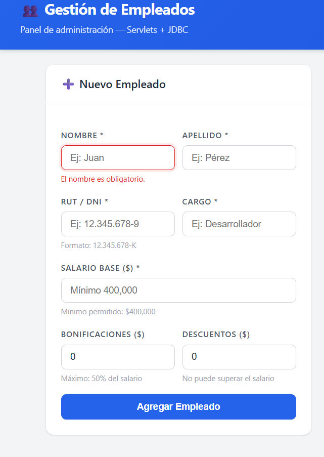
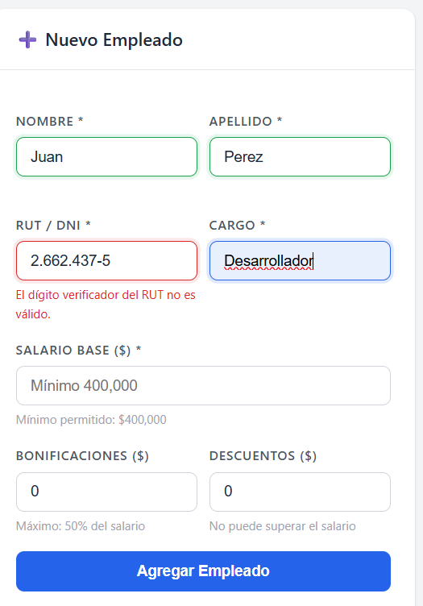
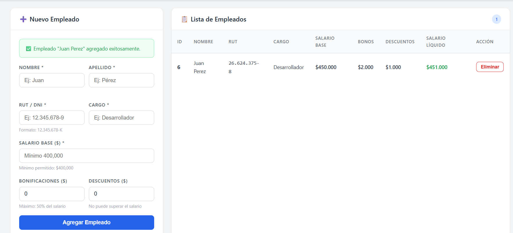
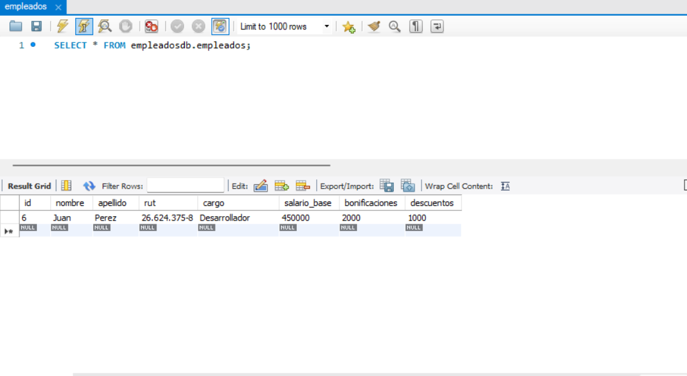
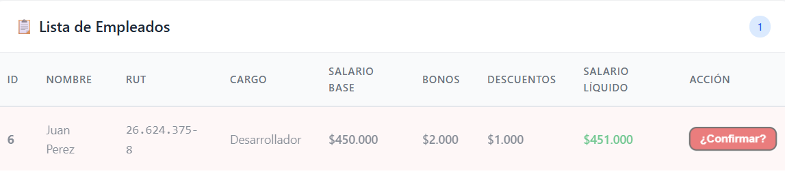

# Flujo del Sistema: Gestión de Empleados

**Módulo:** Administrador de Empleados (CRUD)  
**Arquitectura:** Frontend (HTML/CSS/JS) + Backend (Servlets de Java) + Base de Datos (JDBC / MySQL)  
**Descripción:** Este documento detalla el ciclo de vida y el flujo de datos al interactuar con el módulo de registro y administración de empleados.

---

## Fases del Flujo de Usuario y Sistema

### Paso 1: Ingreso de Datos y Validaciones Iniciales (Frontend)
El usuario interactúa con el formulario "Nuevo Empleado". El sistema cuenta con mecanismos de prevención de errores antes de enviar la petición al servidor.
* **Validación de Campos Vacíos:** Si un campo obligatorio como el nombre no se completa, el flujo se detiene y se alerta al usuario (`El nombre es obligatorio.`).
    * *Ref. visual:* 
  
* **Validación de Lógica de Negocio (RUT):** El sistema evalúa el algoritmo del RUT chileno ingresado. Si el dígito verificador no coincide con el cuerpo, se bloquea el envío (`El dígito verificador del RUT no es válido.`).
    * *Ref. visual:* 
  

### Paso 2: Procesamiento y Cálculo (Integración)
Una vez que el formulario pasa las validaciones del cliente, los datos son enviados al servidor.
* **Confirmación de Éxito:** La interfaz devuelve un mensaje verde indicando que la operación fue exitosa (`Empleado "Juan Perez" agregado exitosamente.`).
* **Cálculo Automático:** El sistema procesa los montos ingresados para generar el **Salario Líquido**. En este caso, suma el *Salario Base* ($450.000) más las *Bonificaciones* ($2.000) y resta los *Descuentos* ($1.000), resultando en **$451.000**. El registro se añade inmediatamente a la "Lista de Empleados" en la vista.
    * *Ref. visual:*
    * 

### Paso 3: Persistencia de Datos (Backend / Base de Datos)
El flujo requiere que los datos no solo vivan en la sesión, sino que se almacenen de forma permanente.
* **Mapeo Relacional:** A través de JDBC, el sistema ejecuta un `INSERT` en la tabla `empleados`.
* **Comprobación:** Al consultar la base de datos (`SELECT * FROM empleadosdb.empleados;`), se verifica que el ID 6 ha sido creado con todos los campos mapeados exactamente como se procesaron en el Paso 2, incluyendo los valores de salario y bonos/descuentos.
    * *Ref. visual:* 
    * 

### Paso 4: Flujo de Eliminación Segura (Frontend)
Si el usuario desea remover un registro, el flujo contempla una capa extra de seguridad.
* **Doble Confirmación:** Al presionar el botón "Eliminar", la acción no se ejecuta de inmediato (previniendo clics accidentales). El botón cambia su estado a rojo con la leyenda "¿Confirmar?". Solo un segundo clic gatilla la petición `DELETE` hacia el servidor.
    * *Ref. visual:* 
    * 
---
*Fin del flujo documentado.*